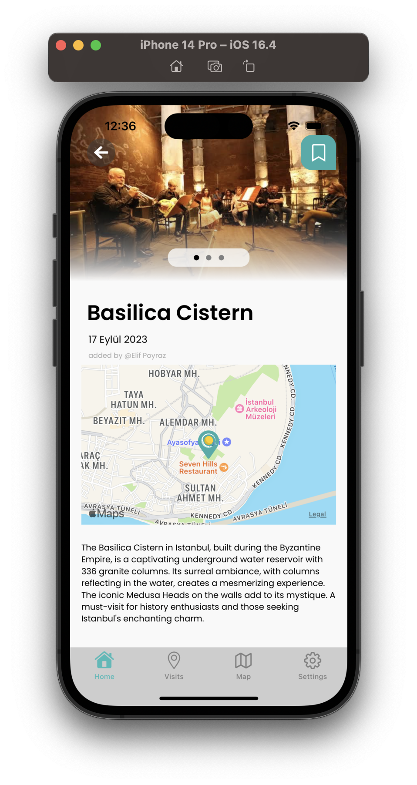
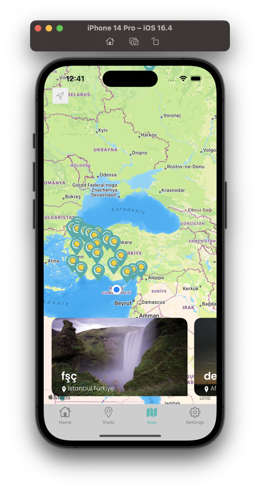
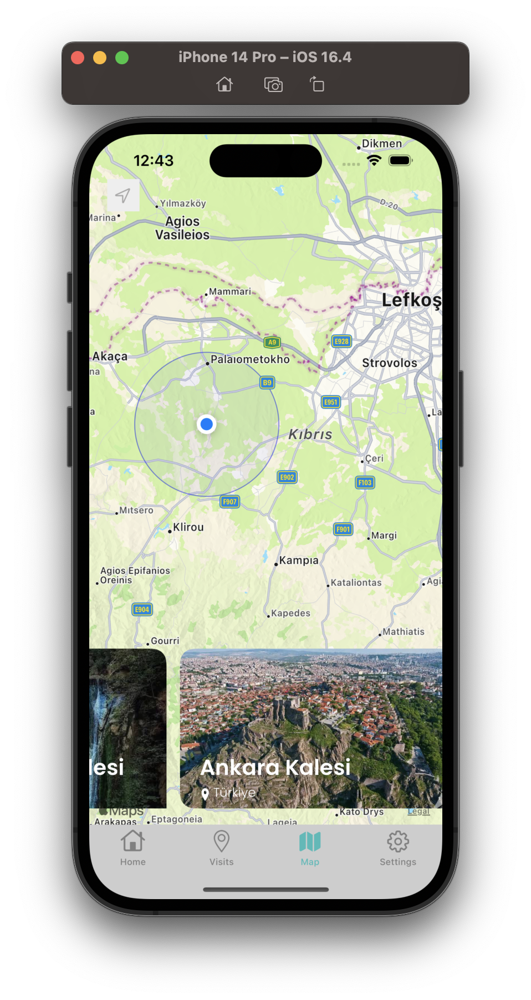
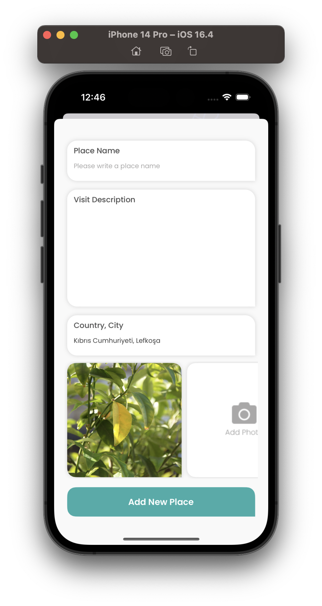

# TravioApp

It allows users to mark places they have visited on a world map. Features such as seeing the places visited by other users on the map, adding these places to own "Visits" page, and seeing popular places and newly added places on the "Home" page are available. You can register immediately and start using the application to see travel details or add your travel destination.


## Installation

Install TravioApp

```bash
  mkdir TravioApp && cd TravioApp
  git clone https://github.com/eimrahor/TravioApp.git
```
then run "TravioApp.xcodeproj" file with XCode


## Screenshots

<p align="center">
  
  
  
  
  
  
  
  
  
  
  
  
  
  
  
  
  
  
</p>


## API Reference

[Travio API Documentation](https://api.iosclass.live/docs)
